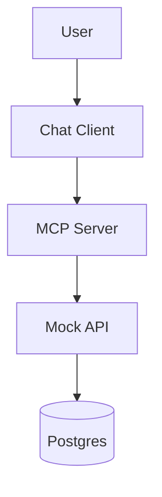

# MCP — Auditoria de Descontos

Sistema que permite a uma IA consultar um banco via API para auditar descontos entre fornecedores e varejistas.

---

## Sumário
- Arquitetura
- Uso rápido
- Estrutura
- Troubleshooting

---

## Arquitetura
- Backend (Docker): Postgres, Mock API, MCP Server
- Cliente: Chat CLI (Local)



**Se o GitHub não renderizar o diagrama, use o diagrama ASCII abaixo:**

User -> Chat Client (Local)
Chat Client -> MCP Server (SSE)
MCP Server -> Mock API (HTTP)
Mock API -> Postgres (SQL)

---

## Uso rápido

**Pré-requisitos:** Docker, Docker Compose, Python 3.10+, `OPENAI_API_KEY`.

**Backend:**
```bash
docker-compose up -d --build
```

**Chat (local):**
```bash
cd chat
pip install -r requirements.txt
```
Crie `chat/.env` com:
```env
OPENAI_API_KEY=sk-...
MCP_URL=http://localhost:8080/sse
```
Execute:
```bash
python chat.py
```

---

## Exemplo de perguntas
- "Quais ferramentas estão disponíveis?"
- "Há divergência de descontos entre X e Y?"
- "Qual desconto foi aplicado para [empresa] no [varejista]?"

---

## Estrutura
- `docker-compose.yml`
- `init.sql`
- `mock_api/` (FastAPI)
- `mcp_server/` (FastMCP)
- `chat/` (cliente Python)

---

## Troubleshooting
- **Connection Refused**: veja `docker logs mcp_server`.
- **Chave OpenAI**: confirme `chat/.env`.
- **Portas**: 5432 (Postgres), 8000 (API), 8080 (MCP).

---

**Contribuições:** abra issue ou PR.

> **Aviso:** mantenha sua chave OpenAI privada.


